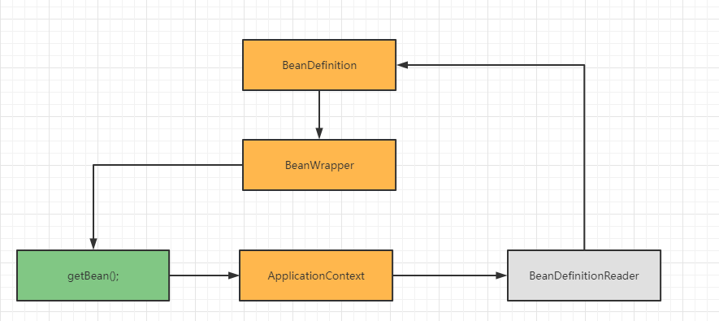

1 Spring 中的 Bean 是线程安全的么？为什么？

> Spring 中的 Bean 是否线程安全和 Spring 无关。因为 Spring 只承担了创建和管理 Bean 的职责，并没有对 Bean 进行任何修改。

2 Spring IOC 和 DI 的工作原理？

> ### Spring IOC 基本流程:
> 
> 定位【定位配置文件和扫面相关的注解】--->加载【将配置信息载入到内存中】--->注册【根据载入的信息，将对象初始化到 IOC 容器中】
> 
> **基于 XML 的定位、加载和注册：**
> 
> 寻找入口--获取配置文件路径--开始启动--创建容器--载入配置路径--分片路径处理策略--解析配置文件路径-开始读取配置文件--准备文档对象--分配解析策略--将配置载入内存--载入 bean 标签--载入 property 标签--载入 property 子标签--载入 list 标签--**分配注册策略**--**向容器注册**
>
> **基于 注解 的容器初始化过程：**
> 
> 定位 Bean 扫描路径--读取元素据--解析--注册 Bean
> 
>> 1、读取配置文件；
>> 
>> 2、解析配置文件，并封装成 BeanDefinition；
>>
>> 3、把 BeanDefinition 对应的实例放入到容器进行缓存；
> 
> ### DI 基本流程
> 
>> 1、循环读取 BeanDefinition 的缓存信息；
>> 
>> 2、调用 getBean() 方法创建对象的实例；
>> 
>> 3、将创建好的对象实例包装为 BeanWrapper 对象；
>> 
>> 4、将 BeanWrapper 对象缓存到 IOC 容器；
>> 
>> 5、循环 IOC 容器执行依赖注入。

3 手绘 Spring IOC 和 DI 部分类结构图

BeanDefinition：保存每个 Bean 配置的解析结果；

BeanWrapper：保存原始对象啊和原始对象的 class；

ApplicationContext：Spring 中最核心的 IOC 工厂，也是 Spring 的主入口；

其中 BeanDefinition、BeanWrapper 和 ApplicationContext 三者关系如下图：

依赖注入关键类：

**IOC 容器：**

ApplicationContext

BeanDefinition

BeanFactory  getBean() 采用的单例 Bean，容器式（lazy）

AbstractBeanFactory

实例化策略：

SimpleInstantiateStrategy

存储实例所有相关信息 scope、proxy、instance

BeanWrapper

统一一个对外访问对象的入口，扩展一些功能，缓存一些配置信息

**DI 依赖注入从哪里开始？**

getBean() why

因为 Spring 默认是 **懒加载** 

getBean（）--instantiateBean() 反射初始化 Bean 独享，发起实例化对象的动作

populateBean() 完成依赖注入，用反射注入，发起依赖注入的动作

实例化有两种情况：

- 目标类配置了 AOP，实例话的对象为代理类

- 目标类没有配置 AOP，实例化原生对象

factoryBeanInstanceCache 用来存 BeanWrapper 的 Map，存储原生 Bean 的包装类

factoryBeanObjectCache 用来存原生 Bean 的 Map，存储反射创建出来的实际的对象

beanDefinitionMap 用来存 BeanDefinitionMap，存储配置信息

**循环依赖注入，用缓存解决依赖注入的问题**
